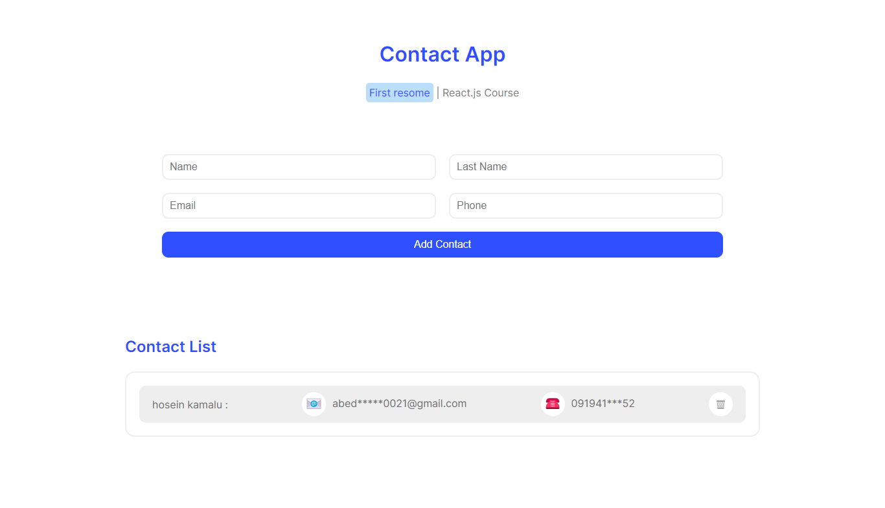

# React + Vite

This template provides a minimal setup to get React working in Vite with HMR and some ESLint rules.
## image Contact website

Currently, two official plugins are available:

## Project Title: Personal Information Manager

# Description:

Introducing the Personal Information Manager, a React-based front-end project that allows users to input and manage their personal information effortlessly. This application offers a straightforward interface for users to enter their first name, last name, email, and phone number. Upon submission, the entered information is saved and can be managed through the intuitive user interface.

## Key Features:

# User-Friendly Form: 
The project features a clean and user-friendly form for entering personal details, promoting a smooth and intuitive data submission process.

# Dynamic Data Display: 
Submitted information is dynamically displayed in a separate section, allowing users to see and manage their saved data easily.

Editable and Deletable Entries: Each saved entry is editable and deletable, providing users with the flexibility to update their information or remove entries as needed.

# State Management: 
Leveraging React state management, the application ensures that user data is handled efficiently and updates are reflected seamlessly in the UI.

# Responsive Design: 
The project is built with a responsive design, ensuring a consistent and visually pleasing experience across various devices.

# Interactive UI Elements:
 The UI elements are designed to be interactive, with clear calls-to-action for submitting, editing, and deleting entries.

# Clear Feedback Messages:
 Users receive clear feedback messages upon form submission, deletion, or editing, enhancing the overall user experience.

# Technologies Used:

React.js
React state management
Responsive design principles
# How to Run:

Clone the repository from [GitHub Repo Link].
Navigate to the project directory.
Run npm install to install dependencies.
Run npm start to start the development server.
Open the application in your browser at http://localhost:3000.
# Note:

This project is a demonstration of front-end functionality. For a complete application, it would need to be integrated with a backend for data persistence.

Feel free to explore the code, make improvements, and use it as a foundation for creating personalized information management systems.

Happy managing!

- [@vitejs/plugin-react](https://github.com/vitejs/vite-plugin-react/blob/main/packages/plugin-react/README.md) uses [Babel](https://babeljs.io/) for Fast Refresh
- [@vitejs/plugin-react-swc](https://github.com/vitejs/vite-plugin-react-swc) uses [SWC](https://swc.rs/) for Fast Refresh
